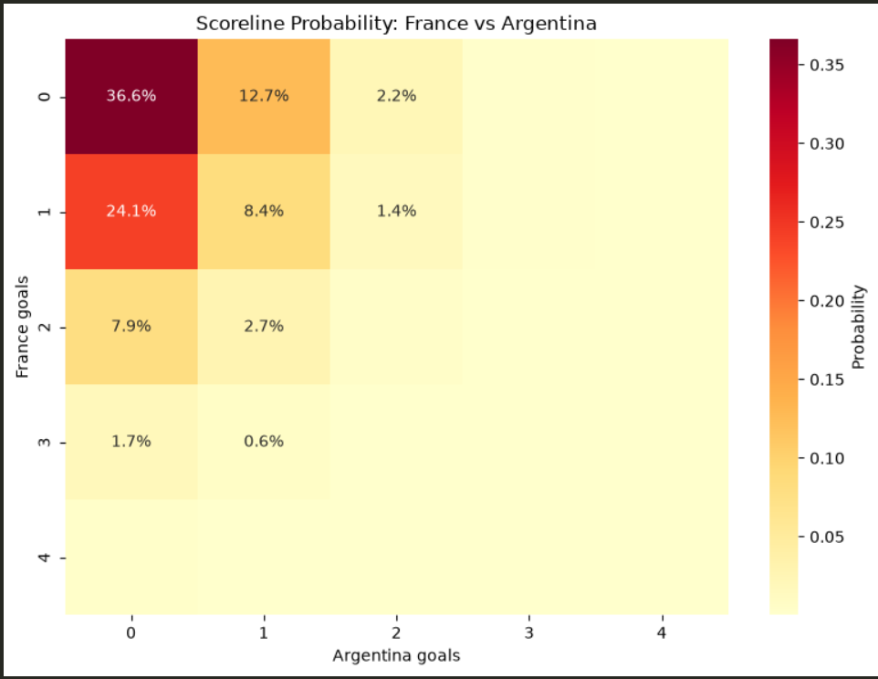
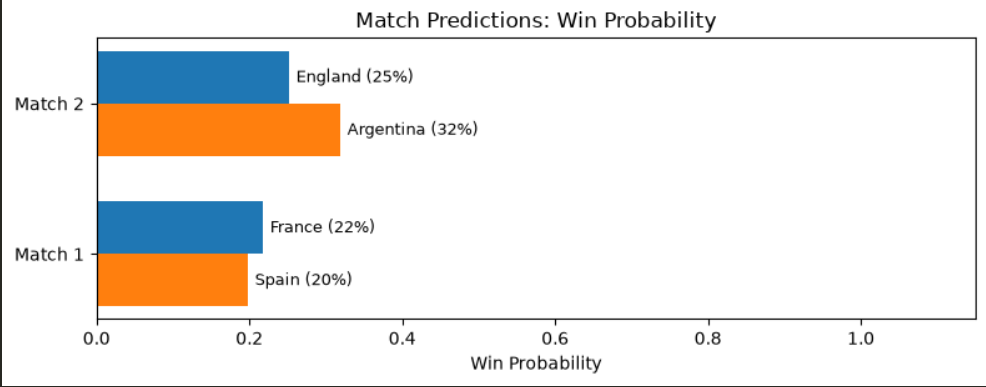
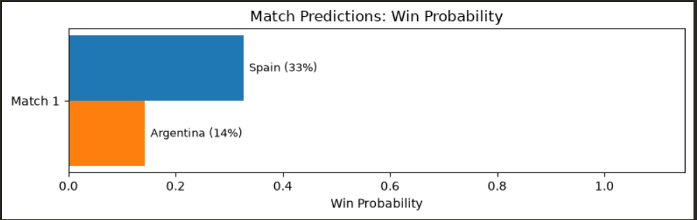

# World Cup 2026 Match Predictor

A Poisson goal-model predictor for World Cup 2026 — win/draw/loss probabilities and scoreline heatmaps from real match data.

## Preview

| Scoreline Heatmap | Sample Prediction Output |
|---|---|
|  |  |

| Win Probability — Semi-final Round | Win Probability — Final |
|---|---|
|  |  |

*The two win-probability charts above were generated at different points in the tournament — the notebook re-fetches live data each run, so predictions were re-generated for the Final once the semi-finals completed.*

## Overview

This project predicts match outcomes for the 2026 FIFA World Cup using a Poisson regression approach: each team's goal-scoring and goal-conceding tendencies are converted into attack and defence ratings, which are then combined to estimate expected goals (λ) for any matchup. From there, a Poisson distribution generates full scoreline probabilities and win/draw/loss odds.

Built as a data science portfolio project, using live tournament data that updates as the World Cup progresses.

## Methodology

Poisson regression is a natural fit here because goals are count data — discrete, non-negative, relatively rare events per 90 minutes — which is exactly the data-generating process the Poisson distribution models.

1. **Data loading** — completed match results are pulled live from [openfootball's World Cup JSON](https://github.com/openfootball/worldcup.json).
2. **Ratings** — for each team, attack and defence ratings are computed from goals scored/conceded so far, relative to the tournament average. A smoothing factor (k=3) is applied to prevent unstable ratings for teams with very few matches played.
3. **Prediction** — for any two teams, their ratings combine to produce expected goals (λ) for each side. These feed a Poisson distribution to calculate:
   - Full scoreline probability matrix (e.g. P(2-1), P(0-0), etc.)
   - Aggregated win / draw / loss probabilities
4. **Knockout matches** — since draws aren't a valid outcome in single-elimination rounds (they go to extra time/penalties, which this model doesn't predict), the knockout winner is taken as whichever team has the higher win probability.

## Sample Prediction

```
France vs Morocco

France Win:  58%
Draw:        24%
Morocco Win: 18%

Most likely scoreline: 2–1  (14.3%)

Top 5 scorelines:
2-1   14.3%
1-0   12.8%
1-1   10.1%
2-0    9.6%
0-0    7.4%
```

Generated with:

```python
from poisson_model import compute_ratings, predict_match

ratings_df = compute_ratings(df)
avg_goals = df['goal_total'].mean()

result = predict_match('France', 'Morocco', ratings_df, avg_goals)
print(result)
```

*(Numbers above are illustrative — replace with real output from your own run.)*

## Model Evaluation

To validate predictive performance, the model was backtested on completed matches (walk-forward: each prediction only uses data available *before* that match was played, so no result leaks into its own forecast).

| Metric | Score |
|---|---|
| Accuracy (match result) | XX% |
| Log Loss | X.XX |
| Brier Score | X.XX |
| Ranked Probability Score (RPS) | X.XX |

- **Accuracy** treats it as a 3-way classification (home win / draw / away win).
- **Log Loss** and **Brier Score** score the full probability distribution, not just the top pick — the model is rewarded for being well-calibrated, not just "right."
- **Calibration plot** — predicted probability vs. observed frequency, bucketed into deciles across all forecasted matches.

*Note: sample sizes are small early in the tournament, so these numbers will tighten up as more matches complete.*

## Project Structure

```
worldcup2026-predictor/
├── src/
│   ├── data_loader.py      # Fetches and cleans match data
│   ├── poisson_model.py    # Ratings, predictions, scoreline matrix
│   └── visualiser.py       # Heatmap and prediction summary charts
├── notebooks/
│   └── wc2026_predictor.ipynb   # Main analysis notebook
└── README.md
```

## How to Run

1. Clone the repo:
   ```bash
   git clone https://github.com/ikigai-hub/2026-World-Cup-Predictor.git
   cd 2026-World-Cup-Predictor
   ```
2. Install dependencies:
   ```bash
   pip install numpy pandas matplotlib seaborn scipy requests jupyter
   ```
3. Launch the notebook:
   ```bash
   jupyter notebook notebooks/wc2026_predictor.ipynb
   ```
4. Run all cells — data is fetched live, so ratings and predictions reflect whatever matches have been completed at the time you run it.

To predict a specific matchup directly in Python:

```python
from poisson_model import compute_ratings, predict_match

ratings_df = compute_ratings(df)
avg_goals = df['goal_total'].mean()

result = predict_match('France', 'Morocco', ratings_df, avg_goals)
print(result)
```

## Limitations

- **Small sample size**: early in the tournament, teams have very few matches, which can produce identical or unstable ratings.
- **Draw-heavy predictions**: modest expected-goals values can inflate draw probability; knockout predictions handle this by ignoring draws entirely.
- **Independence assumption**: each team's goals are modelled independently of the opponent, which simplifies away real tactical interplay between two sides.
- **No goalscorer prediction**: individual scorer data is available in the source but not used here — noted as potential future work.

## Author

**Oluwagbemi Adekoya**
[LinkedIn](https://www.linkedin.com/in/adekoya-oluwagbemi/) · [GitHub](https://github.com/ikigai-hub)